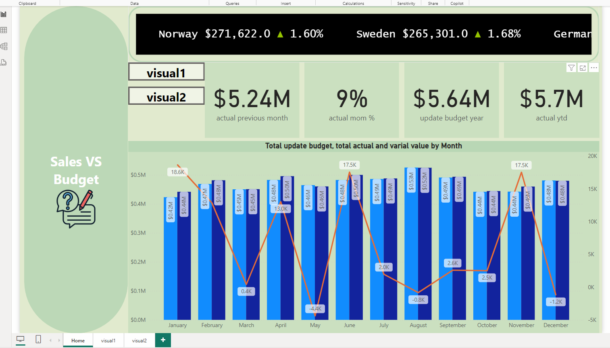

# 📊 Sales vs Budget Analysis

Welcome to the **Sales vs Budget Analysis** project! This project focused on examining the gap between **actual** and **updated budgets**, providing critical insights into financial performance. Below are the key highlights of the analysis:

## 🚀 Key Features of the Analysis

- **💵 Budget and Profit Calculation**:  
  Calculated the **actual budget**, **updated budget**, and **gross profit** to evaluate financial performance.

- **📊 Percentage Difference Analysis**:  
  Analyzed the percentage difference between **actual** and **updated budgets** to highlight deviations.

- **📉 Budget Gap and Profit Margin Visualizations**:  
  Created visualizations to illustrate the budget gap and profit trends clearly.

## 🧐 Insights Gained

This analysis provided valuable perspectives on:  
- 💼 **Financial Performance**  
- 📈 **Budget Deviations**  
- 💹 **Profit Trends**

## 📁 Files and Resources

- Data: `sales_budget_data.csv`
- Visualizations:  
  - Budget Gap Analysis (`budget_gap_chart.png`)  
  - Profit Margin Analysis (`profit_margin_chart.png`)

## 📊 Visualization Example

Here's a sneak peek at one of the visualizations from the analysis:

---

Feel free to explore the data and reach out with any questions! 😊